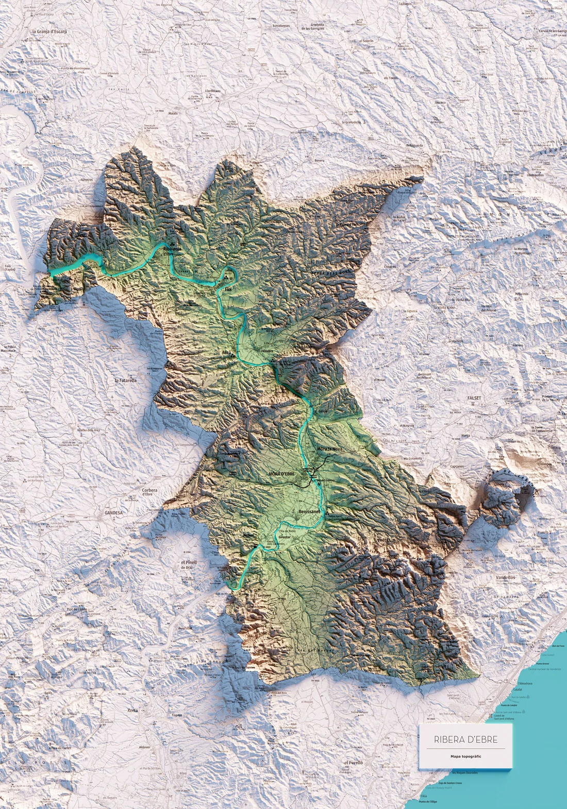
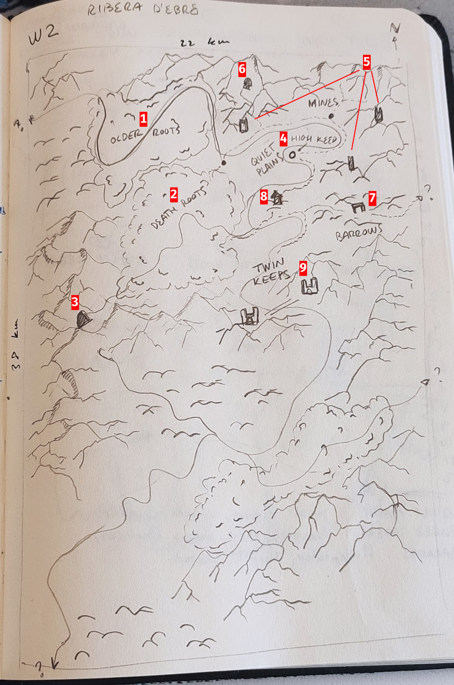

+++
date = "2025-07-02"
updated = "2025-07-02"
categories = ["Itreas", "Gygax 75"]
tags = ["worldbuilding", "itreas"]
title = "Itreas Gate - Gygax 75 - Part 2"
draft = true
+++

Welcome back to the **Gygax 75 Challenge** series, this blog will covers Week 2 of the challenge. If you want to take a look at the previous post, you can find it [here](../itreas-gate-gygax-75-part-1/).

As described in the challenge, we will be drawing a map and start populating it with at least one large settlement, two other kinds of settlement, one major terrain feature, a mysterious site to be explored and one dungeon. It is also recommended to do it in a sheet of hex paper—on the software equivalent—but I will start with some rough sketches and then transfer my map to hex-map in the next blog post.

# Week 2 - Surrounding Area

I took the advise regarding scale. The author recommended 23x14 hexes with a scale of 1 mile to 1 hex which in my opinion is a decent chunk of land. [Here](https://steamtunnel.blogspot.com/2011/09/how-much-adventure-in-one-6-mile-hex.html) I share a blog post where the author shows that the **entire** Elder Scrolls V Skyrim map fits inside a single 6-mile hex, but I digress. Of course, before I could continue ahead, I had changed the miles to kilometers, because _'uropean_, and ended up with a 38x22km approx (roughly 10 6-mile hexes or 10 Skyrim maps). 

This means the area is roughly 836 squared kilometers. As always, this means nothing to my brain so I jumped to Wikipedia to find a more familiar mental image that I could understand. My go-to pages when I try to make sense of actually _"how big an area is"_ is to look at the [Comarques of Catalonia](https://en.wikipedia.org/wiki/Comarques_of_Catalonia) (my homeland). 

I sorted the list table by area and looked for some comarca whose area was somewhat similar to 836, and, low-and-behold, I found [Ribera d'Ebre](https://en.wikipedia.org/wiki/Ribera_d%27Ebre) has an area of roughly 827km², not bad. After finding a geographic map on the internet, I honestly **fell in love with it**, it has everything I want in my initial map and I decided I would use it as my backbone inspiration. 

Here is the topographic image I found [online](https://trobart.cat/products/ribera-debre-mapa-topografic-en-color). 

## Populating the Map

The map above has virtually everything I needed to have for the first map: 
- a huge river running through it
- a mountain range splitting the map in two. 
- a very mysteriously looking isolated blob of mountains to the bottom-right
- good ration of mountainous terrain and lowland terrain
- ...

I mean, I wanted to change a lot of things, but the overall structure is undeniably there. So I took out my notebook and started sketching the rough topographical outline and then sprinkling some locations with placeholder names. After some time I had this (I added some keys to facilitate explaining it later).

You certainly noticed that the bottom half is quite empty, and there is a reason for that. I intend to _**worldbuild by playing**_, meaning that I want to develop just the essentials for an area and then solo-play in it to develop it further. This way I can let my ideas simmer for a while before making them canon. 

With that out of the way, here is **what's in the map** and some ideas I have of what I would like there to be in the bottom half.
- **Older Roots(1)** is the huge north-west forest. It makes the traversal up-river virtually impossible, which is their main function in the map. The forest is home to my version of wood-elves, which I'm still pondering over. Folks from the region know that they live there, but since the elves seek to contact they leave them alone. It is said that powerful witches live there. _Is there something or someone upriver worth discovering?_ 
- **Death Roots(2)** is the second huge forest south of **Older Roots**. The river that runs though it has its source inside a cavern. The **Cavern (3)** is a known and very old entrance to The Dungeon that remains unsealed. Evil and decay seep out of the entrance into the forest, altering the wildlife and harboring monsters. _Is it true that there are untold riches inside the Cavernous Entrance?_
- **Quiet Plains(4)** and **High Keep(4)** are the core of population in the top half of the map. As the name implies, little happens in the plains and everyone—except miners, watchmen and hunters—resides in **High Keep**. The city is built with concentric rings and high walls. It is designed to hold siege for long periods of time and expands a large surface with some indoor fields to produce food. The **Quiet Plains** have several smaller villages with small keeps belonging to the nobles in the region. These keeps act as fortifications and first line of defense. _How's the political scene like in the region?_ _Which faction has the power and which factions are maneuvering to take control?_
- Surrounding the city, the **Three Towers(5)** watch the wilderness for newly surfaced entrances to The Dungeon. At a given time, the towers and surrounding buildings can house a couple hundred soldiers. Very recently one of the towers spotted a **new entrance(6)** north of the map. _What monsters will seep from it if not sealed?_
- **Barrows(7)** are a clear inspiration from Barrowmaze. An ancient resting place, overrun with ghouls and other undead creatures by day and hunted by ghosts and banshees by night, or so say the locals. _What is true and what is not?_ _Is there anything of value in the barrows?_
- **Hunter's Fort** is a long standing trading fort. Merchant caravans do come every season from the south to trade with the **Quiet Plains**. It also acts as a defense structure against the beasts from the **Death Roots** that come from time to time. 
- **Twin Keeps(9)** is an abandoned twin dwarven keep. It is my idea of "low-level" mega dungeon. The keep is ancient and huge, but a good portion of the easy to access floors have been mostly cleaned of any meaningful treasure. Nonetheless, monsters inhabit the deeper parts of the keeps and do want to take control of the upper floors.

## Random Tables

Not completed, tbh
