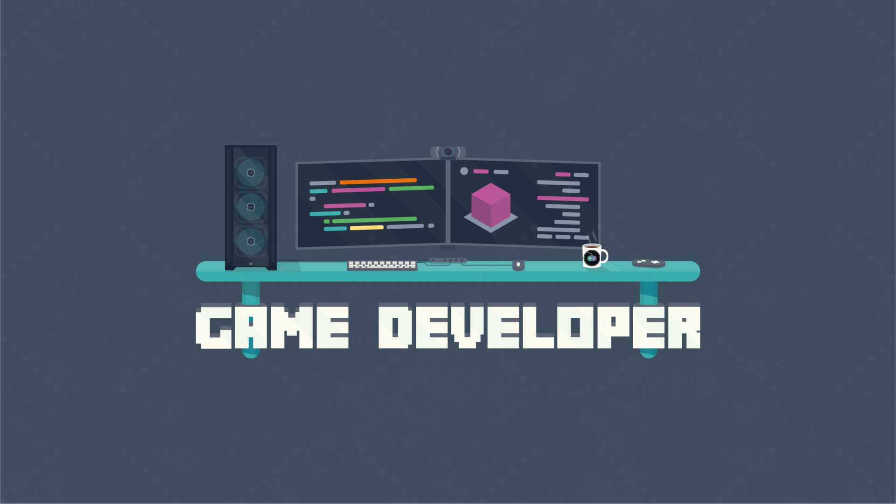

+++
date = "2026-07-12"
updated = "2026-09-23"
categories = ["Blog"]
tags = ["ideas"]
title = "My Plan To Become A Successful Indie Game Dev"
+++

The past few months have been a roller coaster. This post has been in the making for **over three months** (it was suppose to come out in June 2026). After some thoughts and some trial and error, I reached a decision. This post acts as my personal commitment to becoming a successful indie game developer and how my next 18 months look like.[^1]

[^1]: Image by [Shane-Lee Littlewood](https://www.artstation.com/shane-lee)

I think this post will greatly benefit to start by defining what my concepts are:
- **Indie Game Developer:** someone who creates games solo or as part of a small game studio. In my case, it's just me.
- **Successful:** this has two branches: successful games and financially successful.
	- **Successful Games:** consistently deliver games that receive positive reviews, engages players, motivate me to develop and keep learning, and, finally, that ...
	- **Financially Successful:** ... earn enough money to provide for me and my family: pay bills, save up, invest, and occasionally allow for new risky ideas to be tried out.
- **Consistently:** ideally more than once a year. ideally...

So, these are my working definitions. Me, making games whose quality improves over time despite a flop here and there, and that generate enough money to enable me to continue making them.

Now, thankfully I do not start from scratch completely. I've been doing games as side projects for over a decade, but that has been just for fun and those games were not really finished. The good part is that I knew I could learn how to be a **good** game developer. This includes coding (my strongest suit), art, music, design and marketing, just to name a few. The bad part is that I've had no idea how to go from good to **successful**. So I looked around and made a plan. A rough one.

> I fully wrote this post by hand with no AI assistance. I use AI, but not for this type of work. I want you, the reader, to see my genuine thoughts and personal style reflected in these posts.

# The Approach

Three ideas drive my personal approach and shape my next 18 months:
- At the beginning, quantity; at the end, quality.
- Just do the damn "thing".
- Learning from mistakes.

> It will do you some good if you grabbed a couple of Nassim Taleb's books like Antifragile and Skin in the Game; they have had the most impact on shaping my approach to game development and played an important part in my thinking process.

## At the beginning, quantity; at the end, quality

> *In theory there is no difference between theory and practice, while in practice there is.* -- Yogi Berra

Everything that involves game development is a skill, and a hard one to be honest. But skills can be learned, and one learns by doing; and doing A LOT. Whenever you start any artistic endeavor you are the victim of your own personal taste. You certainly have played some games, read books, admired art and heard songs. Whatever you produce when you start is **TRASH**; and that is okay. It's okay that you *know* it to be bad. Do not let it stop you, because if you continue doing it, it will get better.

Also, you are not alone in this. You can now access uncountable amounts of resources online that can help you learn faster and better. There are online communities too; join them. You will learn so much more from watching a couple of hours of how others do than what you can learn alone in a lifetime. Personally, what really helped me was watching some VODs of devs with similar inclinations as me and see their process. Like Randy and Firebelley Games. They are both coders, like me, so I wanted to know how they approach the rest of the game making process: art, sound, game design, marketing, etc. Watching how they approached it made it look more manageable for me and it gave some ideas.

But *just* doing does plateau at some point, and here is where taste enters the stage once again. Now, it's no longer *if* you can do something, because you proved already that you **can**. The issue is if that something you made is any *good*... but good compared to what? I have to keep consuming to hone my taste. I need to play other games to know: what is good and bad, which mechanics players grok and which don't, what is the quality level that I'm trying to beat. This is what will bring a game from *good* to **great**. And I needn't only to consume games, but consume in general.

Similar to the amounts of online resources of "how to do X", you can easily find the outcomes of countless individuals. I'm talking about games, books, movies, series, songs, paintings, ... you name it. Find them and consume them. I need to learn what is out there to understand what the current definition of good is. If I want to be successful I need to understand what success look like, and I can only do that by repeatedly experiencing it; so I must make time to play games and to experience new things.

This approach lets you answer the eternal question: what's more important: the idea or the execution? The answer to me is pretty clear: at the beginnig, the execution; at the end, the idea.

## Just do the damn "thing"

This point is the one that I struggle with the most. And it's transparently simple, yet deceivingly hard. It has already been explained: Just do the damn "thing"!

> *You’re not as good as you think. You don’t have it all figured out. Stay focused. Do better.* -- Ryan Holiday, Ego Is The Enemy

I find it very easy to just work on the code. I'm a coder after all, and I really feel at home when I'm writing code. I find no such ease when it comes to art, or music and sound effects (and do NOT let me get started with marketing... uuh!). Even-though code is a fraction of what makes a game, I naturally gravitate towards it which makes me neglect other more important aspects. Nonetheless, I **must** do the rest, and they, as a result, are the "thing" for me, "the hard thing".

I've given some thought to it and I've reached the conclusion that my ego plays an important role in making this "things" difficult for me. Ego is my enemy. I find it quite embarrassing to put stuff out there that is just **not** good in an almost objective way. But I also have this urge inside me to keep pushing, to keep creating. If that is something that you are also struggling with, here is what helps me.

> Nothing that is worth pursuing is ever easy. You will suck. You will fail. And you will be cringy. That is the price you have to pay to get good at the things you care about. If you care more about the opinions of others, just quit. But if you find yourself unable to quit, just keep going. It will get better.

And I fail more often than not. It is so much easier to give advice than to follow it. But I keep trying. And as a result I've grown more comfortable with my hard things (still not marketing...). Not enough to make any of this *easy*, but **easier**. We all have these natural inclinations, and we all must fight our comfort zone if we want to learn; to grow. If you ever find yourself in a similar position, use accountability to your advantage; it hurts but it works. Like reaching out to friends and family to hold yourself accountable. It really helps. That's exactly what I'm doing here with this post, a friend told me to write it so I'm doing it.

## Learning from Mistakes

> *[The] avoidance of small mistakes makes the large ones more severe.* -- Nicholas Taleb, Antifragile

Preparation, hard work, and learning from mistakes. This is the recipe to success. At least that's what I think. And in order to learn from mistakes, I have to make them; lots of them. Similar to doing the "thing", making mistakes is not pleasant and it encounters the same ego problems. Nonetheless, the best medicine to mute the pain that mistakes inflict on you, is to keep making them. But now that you make them, how do you learn from them?

First of all I need identify that it is, indeed, a mistake. Some are very clear, but others are harder that it looks. Similarly to how you can spot errors to somebody else playing chess but cannot do the same to you, and given that we do not have a "game oracle" that can review all our "moves" and give them an objective score, we need other people to spot the mistakes that we cannot. This is what playtests, demos and feedback rounds are for. With them you learn what bad games are made of, and hopefully we go in the opposite direction.

Then we need to record the mistakes. We should NOT record the proposed solutions, because we want to learn how to fix it ourselves, and finding the solution *is* the learning part. And also because, usually, spotters are not fixers themselves. One can spot others' mistakes, but not necessarily know how to fix them. If you run some playtests, you will rapidly see that players are **always** right when they express discomfort, but they are **habitually wrong** as to why and how to prevent it.

For me, what that means is that I'll be running short playtesting sessions, writing post-mortems on projects and also on some technical topics. Hopefully, by writing the issues and how I plan to fix them, I can improve my pattern recognition and spot these mistakes before I actually make them in the future. I will also be participating in game jams solo so I can receive varying amounts of feedback from people online. I think it's good to not always rely on the same subset of people as playtesters.

# The Plan

With my approach above in mind, the plan is surprisingly straightforward. Three parts, 6 months each, starting from June 2026 till December 2027:
- Months 1-6: Volume and Tools
- Months 7-12: Feedback and Exposure
- Months 13-16: Depth and Taste

I'm not attaching hard numbers to any of this. No specific revenue targets, wishlist goals, view or subscriber count, none of that. I do not want to fall into a [McNamara fallacy](https://en.wikipedia.org/wiki/McNamara_fallacy) here. Those metrics will matter eventually, but right now they are a distraction. The only metric that matters to me at the moment is shipped games. Hopefully I will learn how to make them good. And from that, I'll try to make them successful.

## Months 1-6: Volume and Tools

I will ship a small game every month, 6 in total.

They will be bad, I'm afraid, but I'll do it nonetheless. I will try different genres, mechanics, moods and build a routine. I will hopefully find what resonates most with me, what I feel is *mine*. The objective isn't revenue, I will be uploading all my games for free on Itch.io, but rather to *understand* what it takes to make and finish a game. I expect lots of mistakes and half baked "interactive experiences" rather than really good games.

I'm committed to failing a lot and learning from those mistakes. I'll also devote a week or two every month to extracting the most useful bits of my last game to be repurposed and build any tools that I have an *actual* need for. If I want to succeed in the long run, I need to make my own mountain of software, and I need to grow my toolbelt at every occasion that I can find.

## Months 7-12: Feedback and Exposure

I will still ship a small game every month, 6 in total (This might be a stretch and might have to drop down to 3).

At this point I should have a fairly good idea of what it takes to finish a game. It is time for me to do the "hard things"; starting with the hardest: marketing. I need to get some exposure and the best way for me is to write blog posts and create content online (like Youtube videos and/or Twitch streams). I'm unsure what the online content platform will be, so I'm leaving it as undecided, but I plan on starting during this time period.

I will follow this routine:
- Monday: public devlog/screenshot + what i'll tackle this week.
- Friday: playable build in Itch.io + what's new this week.
- Month-end: Itch release
- Post-mortem

To this point, the games that I uploaded were free; not anymore. I will put them for sale at a low price because I need to validate that players will be willing to pay real money for my games. Then, I'll identify which games got most plays/downloads/engagement and try to find patterns. During this period I will try to participate in a couple of game jams with other people, but we'll see.

## Months 13-16: Depth and Taste

I will produce one larger release on Steam.

I'll pick some of the best candidates from my catalog of games and prepare a larger release on Steam. This may be games that performed very well or one whose idea I think deserves a better try. With 6 months I do not think I can get more than one release, so I will be doing some prototyping and, hopefully, the small community that I've been building the last 6 months can pitch in.

This is a year in the future, so I do not have any idea how it will be, but I would like to follow a routine like this:
- Two weeks for the protoypes -> i'll take 2 of them
- Two weeks to polish the 2 candidates -> i'll take 1
- Four months of production time
- One month of marketing and polish.
- I plan on running playtests on a regular basis.

The objective here is to experience a Steam release. I would like it to make me some money, but honestly it is so much in the future that I have no idea what to expect.

# The Commitment

> *In preparing for battle I have always found that plans are useless, but planning is indispensable.* -- Dwight D. Eisenhower

There will be earning reports down the line. That is part of my commitment too. I want to be transparent and honest of what everything actually costs and eventually earns.

And as the quote says, and I'm sorry for you the reader, this plan is absolutely useless. The act of me, figuring it out, asking myself if I believe I can deliver with these constraints is **essential**. That means, the plan will change. I hope it does so for the better, but we never know.

With that being said, for the next 18 months, this is what I'm *planning* to do. And my expectations are that it will not survive the first contact with the enemy.

The door is open to whoever reads this to ask the hard questions when I start making excuses. I cannot promise outcomes, but I can promise effort. Happy to have you along for the ride.

Let's see what happens.

---
