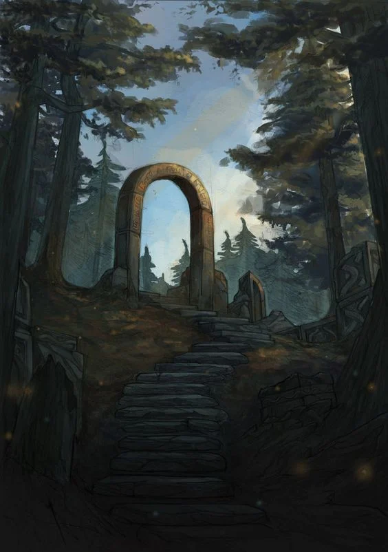

+++
date = "2025-06-04"
updated = "2025-07-02"
categories = ["Itreas", "Gygax 75"]
tags = ["worldbuilding", "itreas"]
title = "Itreas Gate - Gygax 75 - Part 1"
[extra]
image-y = -200
+++

This project comes from a huge mix of ideas that have been bouncing around in my head, pushing me to finally dive in and create **another** world, but this time put as much of the process I can into writing. The blog posts may come sparsely and thin, I'll try to update them as I write further, but keep in mind that I am aiming these posts to be _**for me by me**_.

I'm re-imagining an existing world—called _Itreas Gate_—that I previously used to run a once-west-marches now-single-group campaign. A group of friends helped me test my own TTRPG system, for now called _LMNTS_ (pronounced _elements_, because I’m cool like that). **I’ll be reusing existing maps**, but the core concepts—pitch and inspiration—have changed significantly.

In my earlier campaign, I had ideas to test new systems and mechanics, but I thought it was too much to test everything at once. To pay it safe, I populated the old version of Itreas with D&D-style monsters, cultures, and magic items. This made DMing a **lot** easier but resulted in a  "kitchen-sink" style world that was not to my liking.

**But this is where things change.** I intend to make good on my word and take you along the journey. **Welcome to Itreas Gate.**

_I am pretty sure I grabbed this image from google and I believe the artist is Mihail Topalov._

# But... Why Now?

As I said before, I've had this idea floating around in my mind for a while, but recently, I stumbled upon some **excellent** content online—mostly published books, booklets, and blog posts—that inspired me to start sharing some of my own stuff, even if the quality may not be of my liking all the time. Here’s a small, non-extensive list of inspirations that **actually** motivated me to pull the trigger on this project. 

[Goblin Punch](https://goblinpunch.blogspot.com/) completely changed my perspective on darkness, portraying it as a **living and relentless force**. The concept of the "Hungering Dark" stuck with me—an unstoppable entity that chases adventurers and is only briefly held back by light. That idea made something click and was the spark of this project. [Here](https://goblinpunch.blogspot.com/2025/03/the-hungering-dark.html) is said article. 

> When I first read the article, I thought to myself—**OMG I'm so gonna YOINK that SHIT!**. And being totally honest, I feel this way at least every third article from **Goblin Punch**. I'll be looking into future articles to see what I can adapt to my own world. 

**Into the Wyrd and Wild** brings the wilderness to life in a way that’s both beautiful and terrifying. The Wyrd—force that drives unchecked natural growth—got me thinking about how chaotic magic and nature are unpredictable and dangerous. I have used the **wilderness dungeon procedure** extensively in my west-marches campaign and I loved it. So, when I saw that there was a new book for city adventure in a **Bundle of Holding** bundle... it really got the creative side of my brain running. [Here](https://feral-indie-studios.itch.io/into-the-wyrd-and-wild) and [here](https://feral-indie-studios.itch.io/into-the-cess-and-citadel) are non-affiliated links to the books if you are interested or just visit [Feral Indie Studios](https://feral-indie-studios.itch.io/) Itch.io's website. And do yourself a favor and look into [Bundle of Holding](https://bundleofholding.com). 

> Once again, "yoinking-me" ready to go. I will dive deeper into the procedures and what I like (and don't like) later in the series. But just to reiterate. I believe that **dice dropping** is one of the most efficient ways to get into creative flow—it really works wonders on me.

Talking about creativity... **[Lost Pages](https://lostpages.co.uk/)!**. If I had to summarize it with just one word it would be **FLAVOR**. Cannot describe them better than what they have in their website: _Old School Games, made with 100% pure tantrums"_.  Their content has a distinct—often unsettling—flavor that motivates me to delve into the darker, more enigmatic and moldy facets of world-building. It also set me to the task of wanting to **explain typical clichés with in-world diegetic lore**. If you want distilled flavor, look into their Grimoires: Wonder & Wickedness, Marvels & Malisons and Book of Gaub—brilliant.

> I have some rough ideas as to what I want to do with everything that Lost Pages provides, but for now nothing concrete. Jut the feeling that I will use it in the future or at least be heavily inspired by how they **blend game mechanics with raw diegetic lore**.

**ICON** by [Massif Press](https://massifpress.com/) mixes classic mythic fantasy with anime and video game elements. I love how it blends narrative-driven play with tactical combat, giving me ideas for balancing story and strategy in my own game. To my limited knowledge, it is the first game that has a clear separation—and distinct rules—between tactical, aka combat, and narrative play. No more "intelligent warrior" being useless because strength is not maxxed out. It hit a spot I did not know I had before...

> My main idea from a game-design perspective is to have **"mini-games"**—or small groups of recurring actions inside the world—defined by their own rules, giving a sorta modular game system where every table can pick and choose what areas are they interested to include in their game. Of course, there's **no free lunch**. Said rules would be rather minimal and have sparse interaction between them, but, hopefully, I can turn this limitations into strengths..

And finally, **Gygax 75 Challenge**. This challenge turned the huge task of **actually** start world-building into something manageable. Breaking things down into weekly goals has helped me shape scattered ideas into something solid and playable. [Here](https://plundergrounds.itch.io/gygax75) is the link to the PDF. 

> Although the main "challenge" is supposed to be done in a weekly fashion, for me it will be **more like monthly**—if not every two months. Unfortunately, I cannot invest too much time on an average week, but hope to gather enough for a full post every once in a while. I'll make sure to sprinkle some of my design ideas in-between if I can find the time for it.

# Week 1 - The Concept

In the first part of this project—I will start calling it project since I am not challenging nor being challenged by anything, only my lack of creativity—I need to focus on shaping the core concepts and ideas behind my fantasy world. The PDF advises to get a notebook and start by writing your **pitch and inspirations**.

## The Pitch

**The Pitch** is supposed to be a compelling list of 3 to 7 concise points that capture the essence, excitement, and tone of my world. I tried my best to put here my ideas and also provide a small explanation as to where they come from and how I intend to use them:

1.  _**Iron is antithetical to magic**_. Wearing it interferes with magical powers, spells and rituals. Gold, silver, copper, and some other rarer metals can absorb and store magic to later be used as foci of spells and rituals. Vows made on iron are soul-binding and breaking an **Iron Vow** incurs **Woe** from the universe. 
> Actually this is taken directly from the Gygax 75 Challenge, but I loved it so much I could not stop myself. Unlike Mistborn, I do not plan on focusing on the different properties of each metal. The ideas is that a knight with full armor is almost impervious from a multitude of magic spells. Which, hopefully, introduces drama on the relationship between mages and warriors, bridging the "power-gap" found in other fantasy systems. I took the Iron Vows from Ironsworn because they offer instant flavor and a clear diegetic way of marking character progress.
2. _**The Dungeon is sentient.**_ The planet itself is a prison, holding an ancient, unworldly entity captive at its core. **The Dungeon** is the physical manifestation of the being's struggle to break free. Like bubbles rising from the depths of the ocean, entrances to The Dungeon emerge sporadically. If left unsealed, these openings burst, pouring waves of darkness and corruption on the surface world. 
> Heavily inspired by the Wheel of Time. What can I say? It's a banger. I haven't finished the series so far, so hopefully I'm not spoiling anything on my own, but the main point of this idea is that the Gods sealed some **thing** long ago, and used Earth's rich metal core to contain this entity. This is the reason why iron is antithetical to magic.
3. Fallen stars contain the _**Flame of Divinity**_. Unlike iron, which repels magic, **Starforged Iron**—found withing these celestial remnants—is one of the only substances capable of containing divine energy for a long time. In some fallen stars, the very **Flame of Divinity** still burns inside, waiting to be awakened. In this world, gods were once mortals who ascended, their journey marked by fate and transformed by the celestial spark.
> Cannot think of a single source of inspiration, but the general idea comes from **BECMI**, where characters start as normal folk but their journeys can bring them to immortality and godhood. I thought it could be good to have some reason in-world that could make this sort of journey a possibility for my players, although a very long one.
4. _**Law vs Chaos**_. The archetypal struggle of the universe. Government is largely tribal, dominated by warlords and sprawling city-states vying for control. Civilization itself is divided, with towering city-states serving as bastions of order while nomadic cultures roam the wilds, adapting to the ever-shifting chaos. The chaotic nature of **The Dungeon** makes extremely dangerous for society to populate a large span of wilderness.
> My own answer to the _"unexplored wilds but highly advanced society"_ dilemma. I am eager to explore how good of a fit it is for my table, but I find it an elegant solution to offer rich city intrigue and also vast mysterious wilds. Cannot guarantee anything, but will inform of my findings. I want to make use of The Dungeon entrances to shape the surrounding wilderness by changing already explored but not populated hexes, which would mean that a lot of play could be derived from a smaller map size.
5. The world is in a constant struggle for light. (Typical light vs darkness and law vs chaos struggle, but materialized. Haven't thought of it too much yet)
> What can I say... I am a sucker for these epic-style conflicts. I really like the **law vs chaos** angle, but I wanted to materialize it in a more souls-like way, hence the use of **light vs darkness**. Once I read The "Hungering Dark" from Goblin Punch I knew I wanted to put it inside my dungeons and as the unworldly entity captive in the earth's core. Also, this idea got woven with the "bubbles of evil" from Wheel of Time, giving a very evocative enemy/entity. 

## The Inspirations

**The Inspirations** are books, games, TV series, movies, books—anything really—that inspire me and that evoke "**Itreas**" in my head. Here are they in no particular order. 

 1. _**Dark Souls**_ series by FromSoftware, directed by Hidetaka Miyazaki. These games offer a moldy, entropic atmosphere and a storytelling method rooted in implication not only on narration. The sense of rot, ambiguity, and ruin is a direct influence on the tone and aesthetic that I want to capture. 
 2. _**Delicious in Dungeon**_ by Ryoko Kui and _**ICON**_ by Massif Press. These two bring a sense of grounded fantasy and strong internal logic to the world—where magic, ecology, and economy create a very credible and realistic world. ICON’s minimalistic clarity, heavy asian culture influence and heterogeneous/non-humanoid cultures pairs well with Dungeon Meshi’s richly integrated worldbuilding and character-focused storytelling. I want to tell epic stories about humanity, and some non-human races embody certain traits better than others.
 3. _**Jean Giraud “Moebius”**_ and _**classic/OSR D&D art by Erol Otus, Russ Nicholson, etc**_. The juxtaposition between Moebius’ crisp alien dreams and the rough-handed sketchiness of old D&D zines helps differentiate the common from the alien. Both sides of the coin are essential. I intend on using them both together. Picture this: a destroyed mossy chapel accentuated by rough and thick lines on the paper, but at the center of the room, a clean-lined crystal rod rests on top of the altar, untouched by the dust.
 4. _**Folklore traditions from Japan and Europe**_. These serve as a creative spark, offering creatures, motifs, and narrative rhythms that feel ancient and uncanny. A cultural wellspring for monsters, ruins, and fairy logic. Coming from Europe myself, I've been inspired since childhood by dragons, castles and knights, hence the need to populate my world with them, but I also feel a burning love with Japanese folklore, aesthetic and myths, which I believe can pair very well in Itreas.
 5. _**The Witcher**_ series (books by Andrzej Sapkowski, games by CD Projekt Red), _**Monster Hunter**_ by Capcom, and **Roguelike games** such as _Darkest Dungeon_ or _Caves of Qud_. These influence the brutal ecology of monsters—things are hungry, huge, and dangerous. The lone hunter versus massive beasts is central to the tone alongside the traditional permadeath mechanic of the roguelikes. Itreas is not a typical Epic Fantasy setting, although I want to be able to tell epic stories. The real struggle is surviving evil, winning against evil. Here is a quote from Andrzej Sapkowski: 
 > “Evil is evil. Lesser, greater, middling... makes no difference. The degree is arbitrary. The definition’s blurred. If I’m to choose between one evil and another, I’d rather not choose at all.”  
> — Geralt of Rivia, in "The Lesser Evil"
6. _**Warhammer Fantasy**_ (primarily the old world aesthetic). Its decayed, baroque grandeur and grotesque interpretations of classic fantasy races made me fall in love with orcs and goblins, which I want to give a resemblance of justice in Itreas.
7. _**“Titanic Ruins”**_ – A non-textual theme seen in games like _Shadow of the Colossus_, _Elden Ring_, and some heavy metal album covers. The idea of massive structures built atop long-dead colossi captures the sublime scale of the setting. A guiding principle: size matters—big ruins, big bones, big mysteries.

# Wrapping Up

So that’s Week 1. The **big soup of ideas**. Honestly, this might’ve been more a brain-dump than a cohesive blog post, but I needed to get this stuff out there and create some scaffolding I can hang actual design on.

This post might feel dense, but that’s kinda the point: it’s a ritual of crystallization. A necessary first step before I start refining, trimming, expanding, etc. There are still tons of loose threads I didn’t tug on. But all that _is_ coming... **eventually**.

Thanks for reading—if you did. **Even better**, to all the **brilliant minds** behind **Goblin Punch**, **Feral Indie Studios**, **Lost Pages**, **Massif Press**, and all the **other blogs** I read, to all the **artists**, **designers**, and **writers** whose weird, moldy, fantastic magical lit a fire under me—_**thank you**_. Your blogs, booklets, and busted-up worlds keep dragging me back into the deep dark dungeon that is our hobby. And I appreciate it from the bottom of my heart.

**Next up:** Week 2 of Gygax 75, where I take all these murky concepts and start carving out a small home base. A town, a settlement, a place that clings to the edge of dark. Hopefully with a tavern, a god, and a reason to care about those two.

Until then—

_**Stay weird, write often, delve deep.**_

_**The dark doesn't wait.**_

—MHS